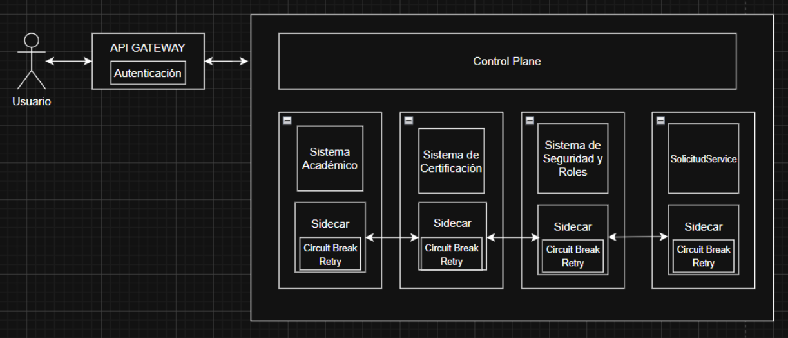
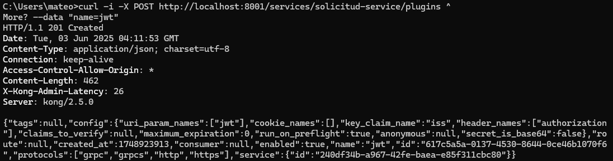
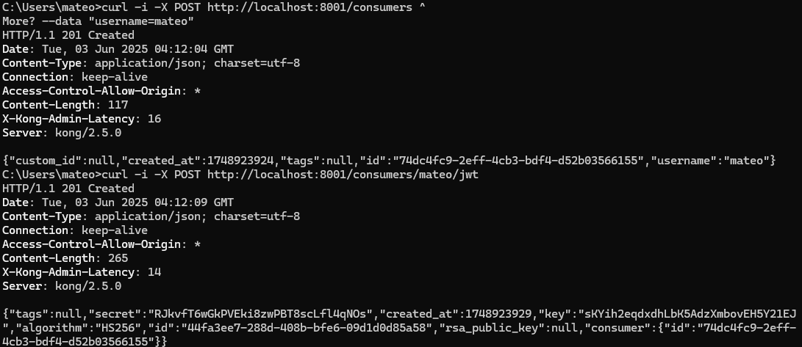
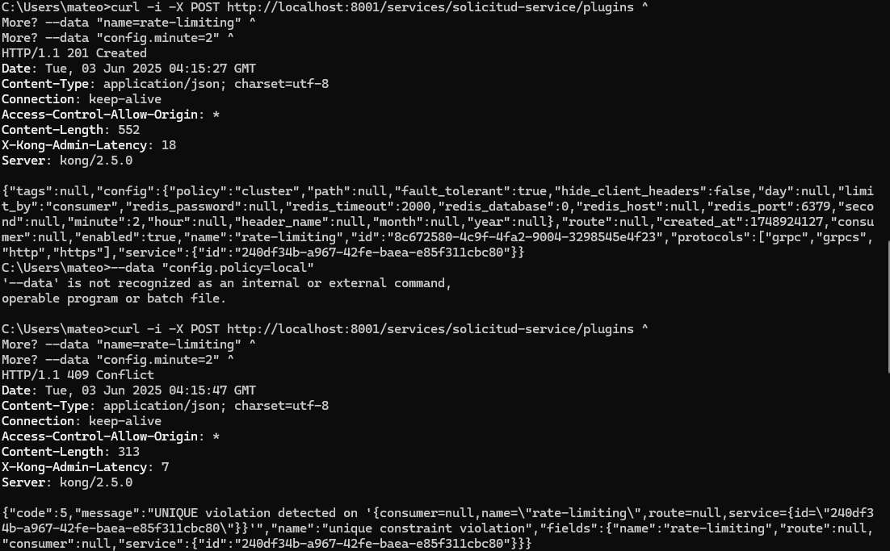

# 📡 Arquitectura y Monitoreo del Sistema

## 🗂️ Diagrama General

Este diagrama muestra el flujo general de las solicitudes a través del sistema:

---

## ⚙️ Configuración del API Gateway (Kong)

### 🔐 Autenticación JWT

Se ha configurado el API Gateway para validar tokens JWT, asegurando que solo los usuarios autenticados puedan acceder a los endpoints protegidos.

  

---

### 🚦 Rate Limiting

Se implementó control de tasa para prevenir abuso y proteger los servicios backend:

---

## 📈 Monitoreo y Trazabilidad

### 🛠️ Herramientas Utilizadas

- **Kiali**: Visualización de la topología del *Service Mesh* (Istio), incluyendo latencias, errores y relaciones entre servicios.
- **Jaeger**: Trazabilidad distribuida para analizar el recorrido completo de las solicitudes a través del sistema.
- **Prometheus**: Recolección de métricas clave de rendimiento y estado de los servicios.
- **Grafana**: Visualización de métricas y trazas mediante dashboards personalizables.

---

### 📊 Métricas Capturadas (Prometheus)

| Métrica                      | Descripción                                                                                 |
|-----------------------------|---------------------------------------------------------------------------------------------|
| Latencia de solicitudes      | Tiempo de respuesta para endpoints REST (`/solicitudes`, `/solicitudes/{id}`) y llamadas SOAP. |
| Tasa de errores              | Porcentaje de respuestas HTTP 4xx y 5xx tanto en `SolicitudService` como en Kong.           |
| Estado del Circuit Breaker   | Estado (abierto/cerrado) de los circuit breakers en las llamadas al Sistema de Certificación (SOAP). |
| Límite de tasa (Rate Limit)  | Número de solicitudes bloqueadas por las políticas de rate limiting configuradas en Kong.  |

---

### 📌 Trazas Capturadas (Jaeger)

| Traza                        | Detalles                                                                                  |
|------------------------------|-------------------------------------------------------------------------------------------|
| `X-Request-ID`               | Identificador único propagado a través de servicios para seguimiento completo de cada solicitud. |
| Tiempos de servicio          | Duración individual de llamadas entre servicios: Kong → SolicitudService → Sistema Académico (REST) → Sistema de Certificación (SOAP). |
| Errores específicos          | Información sobre fallos como timeouts, errores SOAP, o JWT inválidos.                    |

---

