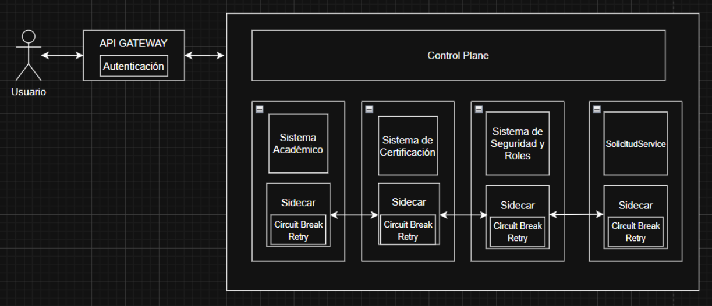
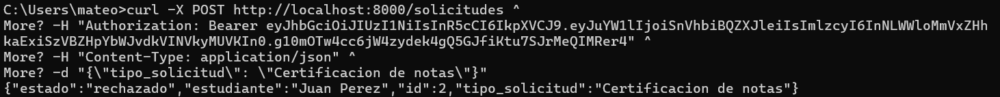
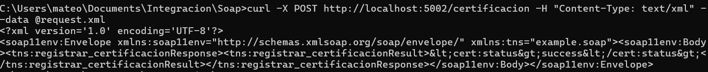
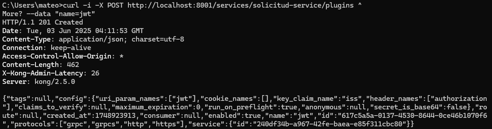
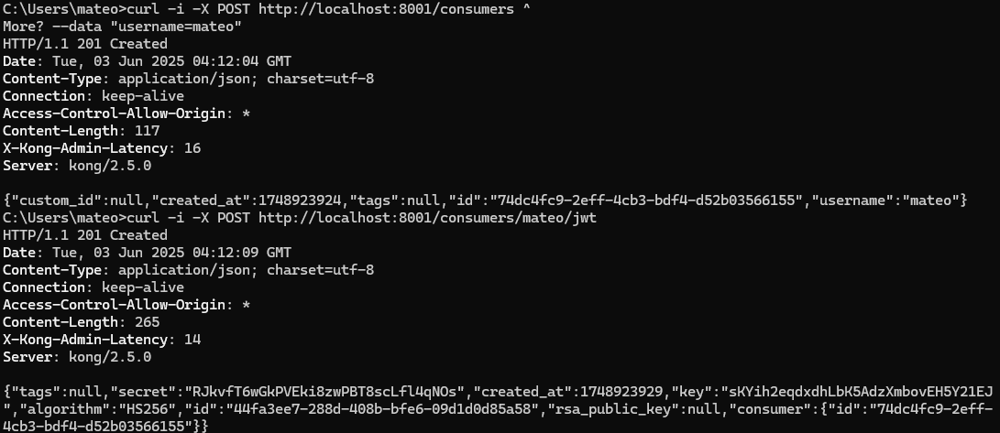
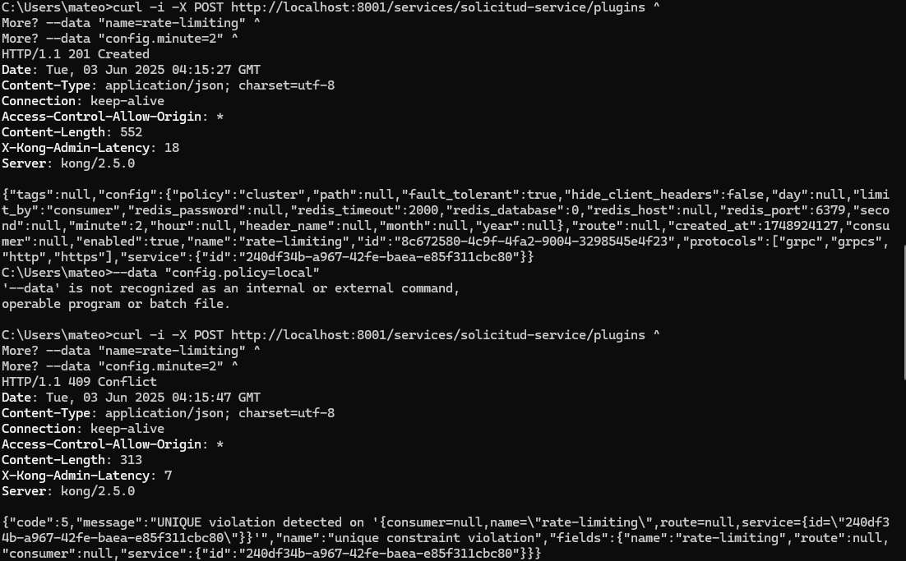

# 📡 Arquitectura y Monitoreo del Sistema

## 🚀 Instrucciones de ejecución

1. **Clonar el repositorio**  
   ```bash
   git clone https://github.com/MateoCartagena/Prueba.git
   ```

2. **Instalar dependencias**  
   ```bash
   pip install -r requirements.txt
   ```

3. **Ejecutar los servicios en terminales separadas**  
   ```bash
   python sistema_seguridad.py
   python sistema_academico.py
   python sistema_certificacion.py
   python solicitud_service.py
   ```

4. **Ejecutar el API Gateway**  
   ```bash
   docker-compose up -d
   ```

---

## 🗂️ Diagrama General

Este diagrama muestra el flujo general de las solicitudes a través del sistema:



La arquitectura representa una solución basada en microservicios para la integración de los sistemas académicos de una universidad. El acceso del usuario se gestiona a través de un API Gateway, que centraliza la autenticación mediante tokens (por ejemplo, JWT). Este Gateway actúa como punto de entrada único para los diferentes servicios que conforman la plataforma.

El sistema está compuesto por cuatro microservicios principales:

- **Sistema Académico** (interno, REST).
- **Sistema de Certificación** (externo, SOAP).
- **Sistema de Seguridad y Roles** (interno, JWT).
- **SolicitudService** (nuevo microservicio REST desarrollado para la integración de solicitudes).

Cada microservicio está acompañado por un *Sidecar*, que implementa patrones de *Circuit Breaker* y *Retry*, asegurando la resiliencia ante fallos temporales o intermitentes en los servicios.

---

## ⚙️ Ejecución

### Llamado a `SolicitudService` a través del API Gateway con respuesta del servicio SOAP





---

## ⚙️ Configuración del API Gateway (Kong)

### 🔐 Autenticación JWT

Se ha configurado el API Gateway para validar tokens JWT, asegurando que solo los usuarios autenticados puedan acceder a los endpoints protegidos.

  


---

### 🚦 Rate Limiting

Se implementó control de tasa para prevenir abuso y proteger los servicios backend:



---

## 📄 Fragmento de configuración (Istio)

A continuación, se muestra cómo aplicar **Retry** y **Circuit Breaking** en Istio para el servicio `solicitudes-service`.

```yaml
# VirtualService para aplicar Retry
apiVersion: networking.istio.io/v1beta1
kind: VirtualService
metadata:
  name: solicitudes-service
spec:
  hosts:
    - solicitudes.local
  http:
    - route:
        - destination:
            host: solicitudes-service
            port:
              number: 80
      retries:
        attempts: 2                    # Intentar máximo 2 veces
        perTryTimeout: 2s             # Cada intento con timeout de 2 segundos
        retryOn: gateway-error,connect-failure,refused-stream
---
# DestinationRule para aplicar Circuit Breaking
apiVersion: networking.istio.io/v1beta1
kind: DestinationRule
metadata:
  name: solicitudes-destination
spec:
  host: solicitudes-service
  trafficPolicy:
    connectionPool:
      tcp:
        maxConnections: 1
      http:
        http1MaxPendingRequests: 1
        maxRequestsPerConnection: 1
    outlierDetection:
      consecutive5xxErrors: 3         # Si hay 3 errores 5xx consecutivos
      interval: 60s                   # Dentro de una ventana de 60 segundos
      baseEjectionTime: 30s          # El destino será expulsado durante 30s
      maxEjectionPercent: 100        # Hasta el 100% del tráfico puede ser expulsado
```
---

## 📈 Monitoreo y Trazabilidad

### 🛠️ Herramientas Utilizadas

- **Kiali**: Visualización de la topología del *Service Mesh* (Istio), incluyendo latencias, errores y relaciones entre servicios.
- **Jaeger**: Trazabilidad distribuida para analizar el recorrido completo de las solicitudes a través del sistema.
- **Prometheus**: Recolección de métricas clave de rendimiento y estado de los servicios.
- **Grafana**: Visualización de métricas y trazas mediante dashboards personalizables.

---

### 📊 Métricas Capturadas (Prometheus)

| Métrica                      | Descripción                                                                                     |
|-----------------------------|-------------------------------------------------------------------------------------------------|
| Latencia de solicitudes     | Tiempo de respuesta para endpoints REST (`/solicitudes`, `/solicitudes/{id}`) y llamadas SOAP. |
| Tasa de errores             | Porcentaje de respuestas HTTP 4xx y 5xx tanto en `SolicitudService` como en Kong.              |
| Estado del Circuit Breaker  | Estado (abierto/cerrado) de los circuit breakers en las llamadas al Sistema de Certificación (SOAP). |
| Límite de tasa (Rate Limit) | Número de solicitudes bloqueadas por las políticas de rate limiting configuradas en Kong.       |

---

### 📌 Trazas Capturadas (Jaeger)

| Traza               | Detalles                                                                                           |
|---------------------|----------------------------------------------------------------------------------------------------|
| `X-Request-ID`      | Identificador único propagado a través de servicios para seguimiento completo de cada solicitud.  |
| Tiempos de servicio | Duración individual de llamadas entre servicios: Kong → SolicitudService → Sistema Académico → Sistema de Certificación. |
| Errores específicos | Información sobre fallos como timeouts, errores SOAP, o JWT inválidos.                            |

---
